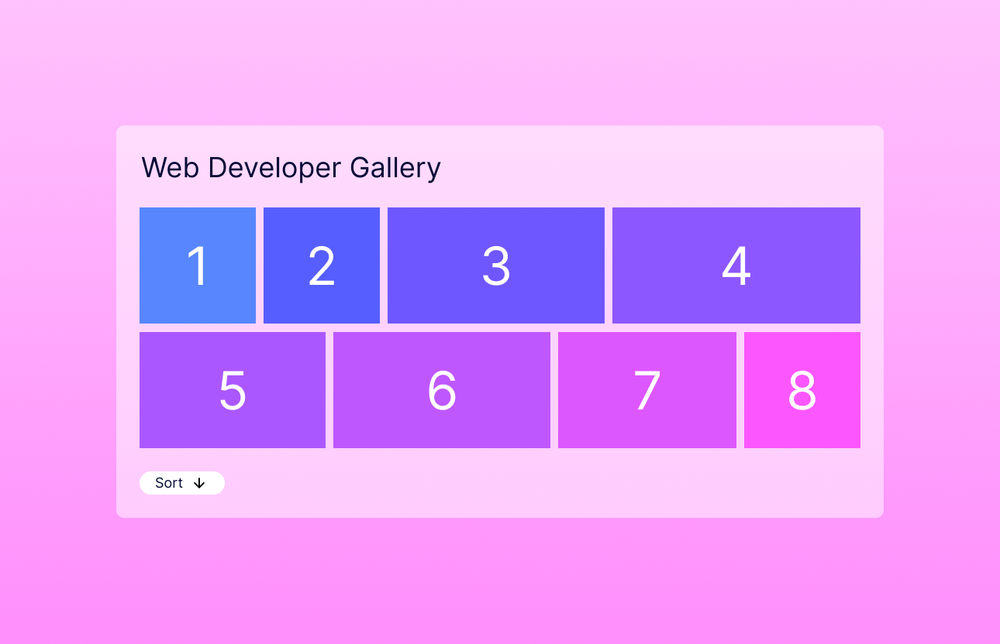

# Web Developer Task

Hi there! Today's task is to replicate a simple gallery page in a starter Next.js app. 

You can refer to the design.png file in this repository or use a figma design you can find [here](https://www.figma.com/design/cqwIYXNHitVg2nAlMBfObA/Web-Developer-Test?node-id=0-1&t=nQJuZMDmryzLddLl-1)

This project uses [`next/font`](https://nextjs.org/docs/basic-features/font-optimization) to automatically optimize and load Inter, a custom Google Font.

# Steps

1. Please checkout this repository and create a new branch with your name
2. To install and run the app either
   1. `npm install` and then `npm run dev`
   2. `yarn install` and then `yarn dev`
3. Edit the ./app/page.tsx file - you can add other files for new react components if you'd like - making a page as close as possible to the design shown. The page should display the images and have a button that reverses the sorting
4. Use the hook useGalleryData (`./lib/useGalleryData') to load the image data - but BEWARE, the JSON data used by the hook has a problem, please fix that!
5. **_Remember to publish the branch and push your code changes to `origin` at the end of the task_**